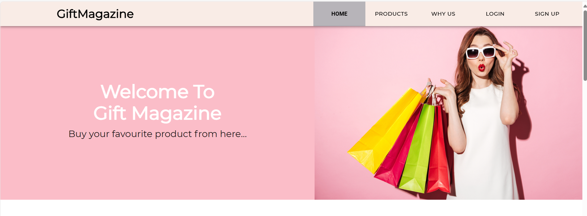
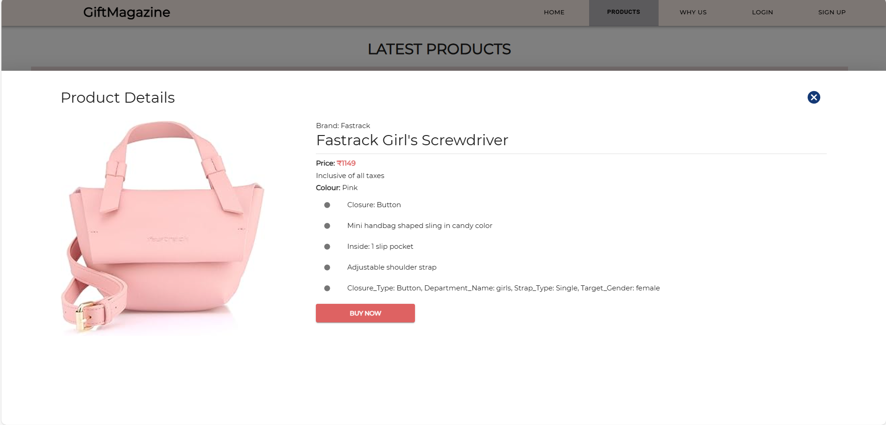

Perfect! Based on your clarification, here's the **updated and accurate `README.md`** for your **GiftMagazine** project — reflecting:

* ✅ **TypeScript**
* ✅ **Material UI (MUI)**
* ✅ **`public/` folder for assets**
* ✅ **`modules/` instead of `components/`**
* ❌ **No Tailwind or Faker.js**

---

````markdown
# 🎁 GiftMagazine – E-commerce Web App for Gifting Your Loved Ones



**GiftMagazine** is a modern e-commerce website built with React, TypeScript, and Material UI. It allows users to explore and purchase thoughtful gifts like clothes, watches, rings, and more — all wrapped in a responsive, elegant UI.

---

## ✨ Features

- 🛒 **Product Catalog** – Browse categories like fashion, accessories, rings, and more
- 📄 **Product Details** – View in-depth details with images, pricing, and descriptions
- 🛍️ **Shopping Cart** – Add, remove, and manage items in the cart
- 💻 **Responsive Design** – Seamless experience across mobile, tablet, and desktop
- 🔄 **Page Routing** – Smooth navigation with React Router
- ⚛️ **Component-Based Architecture** – Built using `modules/` for scalable structure
- 🎨 **MUI (Material UI)** – Modern, accessible, and customizable UI components
- 🧠 **TypeScript** – Type safety and improved code maintainability

---

## 🚀 Tech Stack

| Tech           | Description                            |
|----------------|----------------------------------------|
| React.js       | Component-based frontend framework     |
| TypeScript     | Strongly typed JavaScript              |
| MUI (v5+)      | Material Design UI components          |
| React Router   | Client-side routing                    |
| Local Storage  | Cart persistence across sessions       |

---

## 🖼️ Screenshots

### 🏠 Home Page  


---

### 🛍️ Product Listing  


---

### 📦 Product Detail Page  


---

## 🧑‍💻 Getting Started

```bash
git clone https://github.com/khushbu-asati/GiftMagazine.git
cd GiftMagazine
npm install
npm start
````

Open `http://localhost:3000` in your browser.

---

## 📁 Folder Structure

```
GiftMagazine/
├── public/
│   ├── assets/              # Product images & icons
│   └── screenshots/         # App UI screenshots for docs
├── src/
│   ├── modules/             # Reusable UI modules (Cards, Layouts, etc.)
│   ├── pages/               # Home, Products, Cart, etc.
│   ├── routes/              # Routing config
│   ├── types/               # Shared TypeScript types
│   ├── utils/               # Helper functions
│   └── App.tsx              # App root and route setup
```

---

## 👩‍💻 Author

**Khushbu Asati**
Senior Frontend Engineer
🌐 [Portfolio](https://khushbuasati.vercel.app)
📧 [khushbuasati06@gmail.com](mailto:khushbu.asati@example.com) (replace with your real email)

---

## 💡 Why This Project?

GiftMagazine demonstrates strong frontend engineering practices including component modularity, state management, type safety, responsive design, and clean UI using MUI. It's designed to showcase skills in building production-ready e-commerce experiences.

---

## 📌 Future Enhancements

* [ ] Integrate real payment gateways (e.g., Stripe)
* [ ] Add user authentication and order history
* [ ] Backend with product database (Node.js + MongoDB)
* [ ] Product reviews & wishlists
* [ ] Admin panel for product management

---

## 📝 License

This project is licensed under the [MIT License](LICENSE).

```

---

### ✅ Next Steps for You:
1. Create a `screenshots/` folder **inside your `public/` directory**.
2. Add images like:
   - `homepage.png`
   - `products.png`
   - `product-detail.png`
   - `cart.png`

3. Commit and push `README.md` and screenshots to GitHub.
4. Update GitHub description to:  
   **"An elegant React + TypeScript e-commerce site built with MUI."**

---

Would you like a custom **banner image** or **deployment help (Vercel/Netlify)** next?
```
